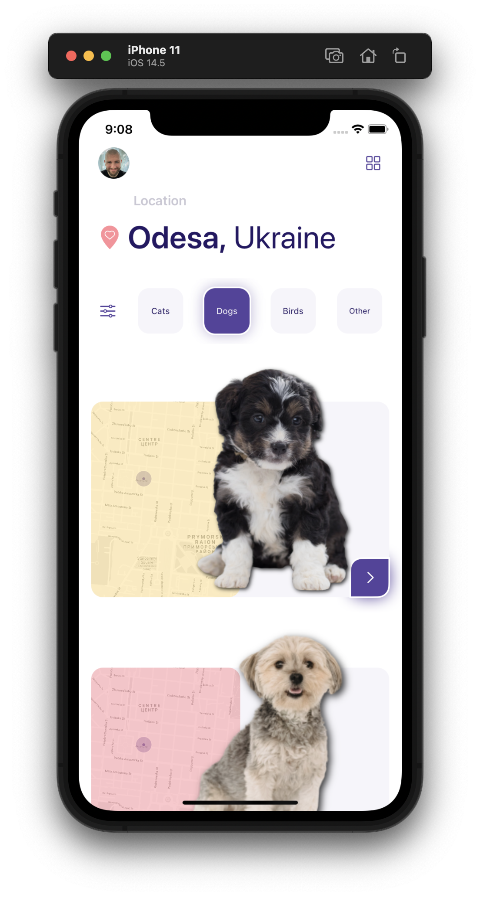
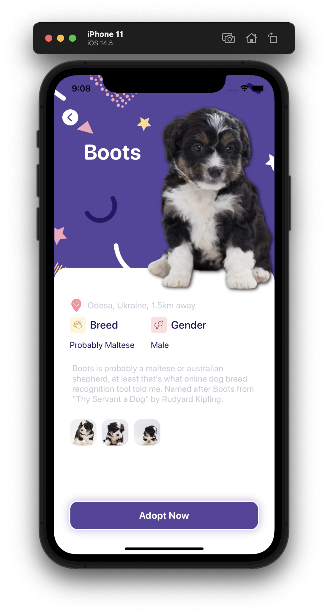

# Pet Adoption App UI #

SwiftUI implementation of [Pet Adoption App](https://dribbble.com/shots/14380227-Pets-Adoption-App) design by [Nadya Lazurenko](https://dribbble.com/NadyaLazurenko) from dribbble.com.

# Image Credits: #

- Puppy Photos ([1](https://www.pexels.com/photo/close-up-photo-of-furry-puppy-1458914/), [2](https://www.pexels.com/photo/tricolor-maltese-puppy-1458909/), [3](https://www.pexels.com/photo/short-coated-black-and-white-puppy-1458913/), [4](https://www.pexels.com/photo/black-and-white-poodle-puppy-1458924/)) by [poodles2doodles](https://www.pexels.com/@poodles2doodles) from pexels.com

- [Puppy Photo](https://www.pexels.com/photo/cute-fluffy-puppy-against-white-background-5733178/) by [sam-lion](https://www.pexels.com/@sam-lion) from pexels.com

- [Paw Icon](https://thenounproject.com/search/?q=paws&i=2569237) by rivercon from the Noun Project 

- [Gender Icon](https://thenounproject.com/search/?q=gender&i=4166959) by zafdesign from the Noun Project

- [Pin Icon](https://thenounproject.com/search/?q=location+heart&i=3770860) by Kmg Design from the Noun Project